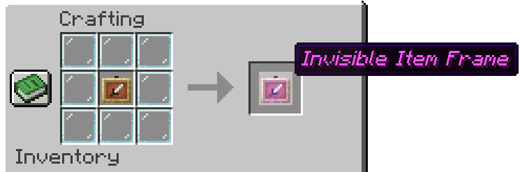

# Paper Invisiframes

This plugin enables the use of invisible item frames for survival players.

Invisible item frames are crafted by surrounding an item frame with 8 glass panes.



In 1.17+, an invisible glow item frame can be crafted by surrounding a glow item frame with 8 glass panes.

## Permissions
Permission | Description
--- | ---
`paperinvisiframes.place` | Allows the player to place an invisible item frame (enabled by default)
`paperinvisiframes.craft`| Allows the player to craft an invisible item frame (enabled by default)
`paperinvisiframes.cmd` | Allows the player to run commands from this plugin
`paperinvisiframes.reload` | Permission to run `/iframe reload`
`paperinvisiframes.forcerecheck` | Permission to run `/iframe force-recheck`
`paperinvisiframes.get` | Permission to run `/iframe get`

## Commands
Permission required for all commands: `paperinvisiframes.cmd`

Command | Description | Permission
--- | --- | ---
`/iframe` | Shows all commands, plugin creators and the plugin verion | `none`
`/iframe get` | Gives the player an invisible item frame | `paperinvisiframes.get`
`/iframe reload` | Reloads the config | `paperinvisiframes.reload`
`/iframe force-recheck` | Rechecks all loaded invisible item frames to apply glowing effect based on config | `paperinvisiframes.forcerecheck`

## Config
```yaml
# Whether or not to enable invisible item frames glowing when there's no item in them
# This will also make them visible when there's no item in them
item-frames-glow: true
```
